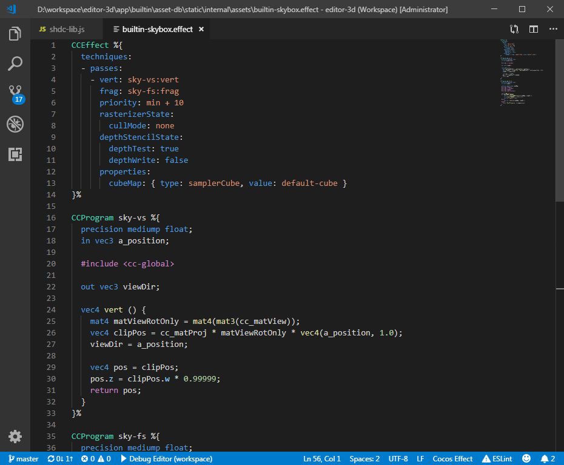

# Cocos Effect

## Features

1. Provide syntax/semantics highlight support for Cocos Effect file in VS Code.
2. Provide auto-completion support for Cocos Effect file in VS Code.
3. Provide hover support for Cocos Effect file in VS Code.
4. Provide Signature Help support for Cocos Effect file in VS Code.

## Requirements

- The [Shader languages support for VS Code](https://marketplace.visualstudio.com/items?itemName=slevesque.shader) extension

## Documentation

[Cocos Creator User Manual](https://docs.cocos.com/creator/manual/)

## Release Notes

### 0.0.1

Initial release of the Cocos Effect extension - a simple syntax highlighter.

### 0.1.0

Fix embedded language support, now commends works in different blocks.

### 0.2.0

Add .chunk file to supported extension list.

### 0.3.0

Finally we have a logo!

### 0.4.0

Add semantic highlighter, language server.

### 0.4.2

Remove cocos completion provider, use default completion provider instead.

### 0.4.3

Bug fix